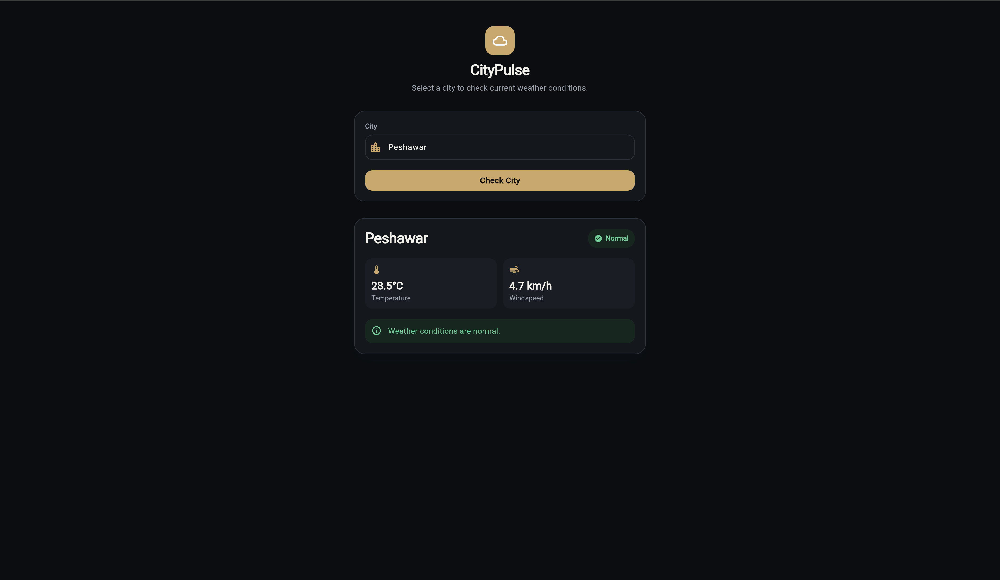
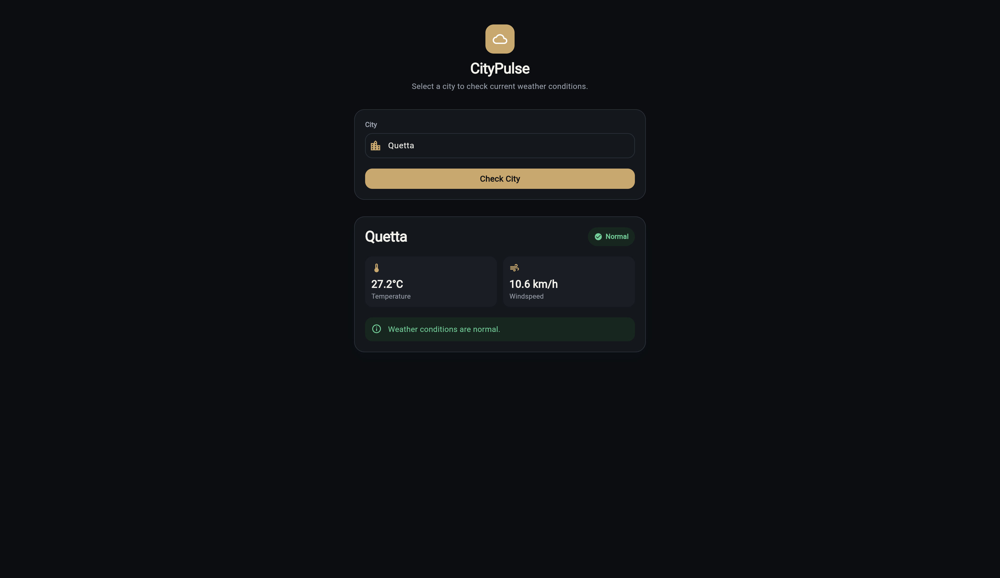
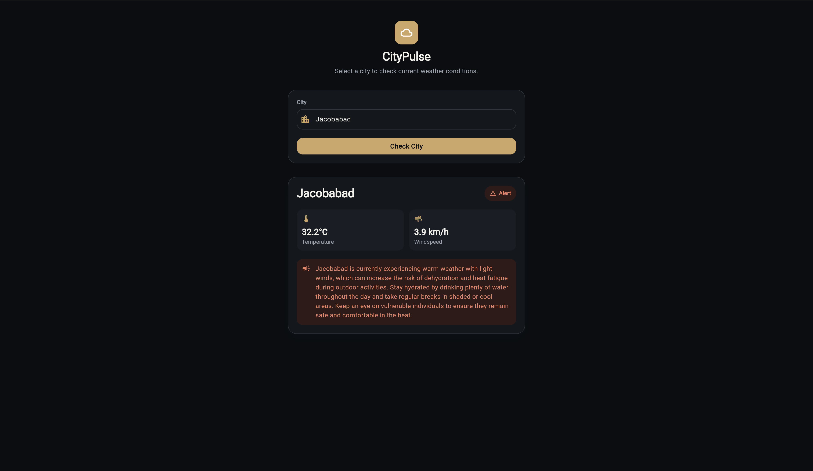

# CityPulse

CityPulse is a Flutter weather app paired with a Make.com automation. A user searches for a city, and the automation checks live weather data, decides whether conditions are extreme, and — if needed — emails an AI-generated safety advisory.

## Overview

- **Frontend:** Flutter app where a user selects/types a city and taps "Check City"
- **Backend:** A single Make.com scenario (no custom server) that geocodes the city, fetches current weather, evaluates it, and returns a JSON response
- **Alerting:** If temperature is above 30°C or below 4°C, an AI-written advisory is generated and emailed, and the event is logged so the same city isn't alerted twice in one day

## Preview

<p align="center">
  
  
</p>

<p align="center">
  
</p>

## Architecture

<p align="center">
  
</p>

```
Flutter App
    │  POST { "city": "<name>" }
    ▼
Make.com Webhook
    │
    ▼
Geocode city → lat/long  (Open-Meteo Geocoding API)
    │
    ▼
Fetch current weather      (Open-Meteo Forecast API)
    │
    ▼
Router
    ├── Normal (4°C–30°C) ─────────────► Respond: status = "normal"
    │
    └── Extreme (>30°C or <4°C)
            │
            ▼
        Already alerted today? ── yes ──► Respond: status = "alert" (no email)
            │ no
            ▼
        Generate advisory (Gemini)
            │
            ▼
        Send email (Gmail) + log alert (Data Store)
            │
            ▼
        Respond: status = "alert"
```

## Backup alert email

<p align="center">
  
</p>

## Tech stack

| Layer | Tool |
|---|---|
| Mobile app | Flutter |
| Automation / backend logic | Make.com |
| Weather + geocoding data | Open-Meteo API |
| Advisory text generation | Google Gemini |
| Email delivery | Gmail |
| Duplicate-alert tracking | Make Data Store |

## Project structure

```
lib/
├── constants/
│   ├── api_constants.dart     # Webhook URL config
│   └── cities.dart            # Suggested city shortlist
├── models/
│   └── weather_response.dart  # Parses the webhook's JSON response
├── services/
│   ├── weather_api_service.dart     # Calls the webhook
│   └── weather_api_exception.dart
├── screens/
│   └── home_screen.dart
├── widgets/
│   ├── city_selector.dart
│   ├── weather_result_card.dart
│   └── error_card.dart
├── theme/
│   └── app_theme.dart
└── main.dart

Weather_Alert_Webhook_blueprint.json   # Importable Make.com scenario
```

## Getting started

**1. Import the automation**
- In Make.com, create a new scenario and import `Weather_Alert_Webhook_blueprint.json`.
- Connect your Gmail and Gemini accounts to the relevant modules.
- Open the "Custom Webhook" module and copy its URL.

**2. Configure the app**
- Open `lib/constants/api_constants.dart`.
- Replace the placeholder `webhookUrl` with the webhook URL from step 1.

**3. Run the app**
```bash
flutter pub get
flutter run
```

For a deeper breakdown of every module in the Make.com scenario, see [DOCS.md](DOCS.md).

## License

MIT
